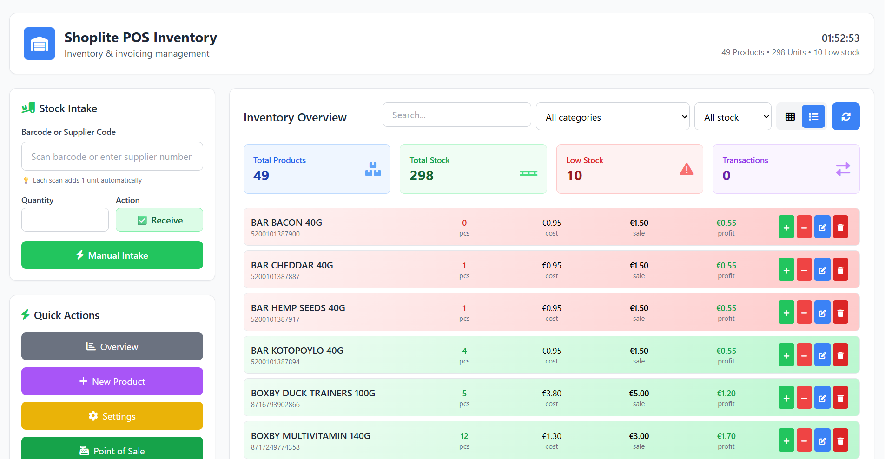
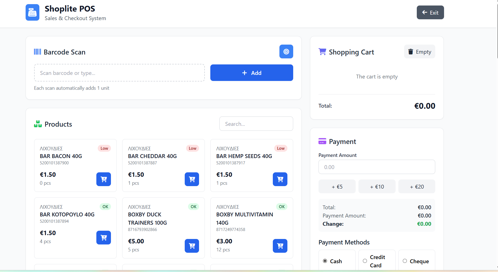
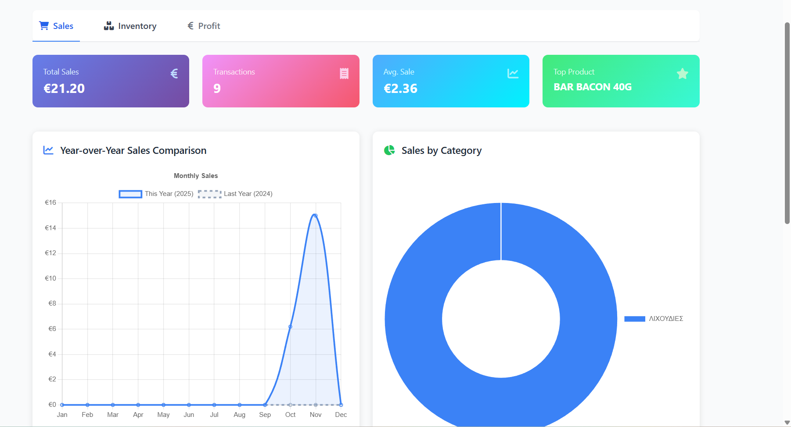
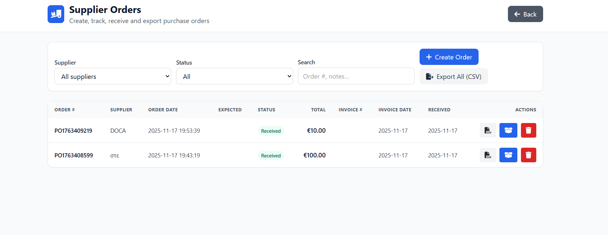

  

<h1 align="center">Shoplite POS</h1>

  Modern Inventory & POS System for Small Retail Shops  
  (5-day trial + Offline License Activation)

  
  
  

---

## 📦 Overview

**Shoplite POS** is a fast, lightweight and user-friendly inventory and point-of-sale system designed for small retail businesses.  
It helps shop owners manage stock, track sales, receive purchase orders, monitor profits, and maintain complete control over their store — all through a clean, modern interface.

Built with **Python (Flask)** and packaged for Windows, it works entirely offline and stores all data locally.

---

## 🚀 Key Features

**Inventory Management**  
- Barcode scanning support  
- Supplier code system  
- Low-stock alerts  
- Profit calculator (per product & total)  
- Instant search + category filtering  
- Real-time stock dashboard  

**Sales / POS System**  
- Fast checkout  
- Barcode scanning adds items automatically  
- Multiple payment methods (cash, card, cheque)  
- Automatic change calculation  
- Clean, responsive layout  

**Purchase Orders**  
- Create & track purchase orders  
- Receive stock directly from PO  
- Export orders to CSV  
- Status management (Pending / Received)  

**Product & Category Management**  
- Add/edit/delete products  
- Manage categories & suppliers  
- Automatic cost/sale/profit calculations  

**Analytics Dashboard**  
- Sales overview  
- Year-over-year revenue chart  
- Category breakdown  
- Best-selling products  
- Total transactions  

**Licensing System**  
- 5-day trial (full functionality)  
- Offline activation for full version  
- License format: `SHOPLITE-XXXX-YYYY`  

---

## 🖼️ Screenshots

> Place your screenshot images inside: `/screenshots/`

### 🔐 License Screen  

### 📊 Inventory Overview  

### ➕ Add New Product  

### ⚙️ Categories & Suppliers  

### 🛒 Point of Sale  

### 📈 Analytics Dashboard  

### 📦 Purchase Orders  

---

## 🖥️ System Requirements

- Windows 10 or newer (64-bit)  
- 4 GB RAM minimum (8 GB recommended)  
- 150 MB free disk space  
- .NET Framework 4.7 (if required by installer)  

---

## 🛠 Installation

1. Download the installer (coming soon).  
2. Run **Shoplite_POS_Setup.exe**.  
3. On first launch choose:  
   - **Start 5-Day Trial** or  
   - **Activate License**
   - 
No internet connection required.

---

## 🔑 Licensing System

- Fully-functional 5-day trial  
- Offline activation for full version  
- License key format:

SHOPLITE-XXXX-YYYY

Future updates will include online activation and license sync.

---

## 📂 Project Structure

Shoplite_POS/
│
├── templates/ # HTML templates (Flask)
├── static/ # CSS, JS, icons
├── assets/ # logos & UI elements
├── images/ # other resources
├── screenshots/ # README images
│
├── Shoplite_POS.py # main application
├── requirements.txt
├── LICENSE
└── README.md

---

## 🛣️ Roadmap

- Online license validation server  
- Multi-PC license sync  
- Cloud backup  
- Printable receipts & export  
- MacOS version  
- Dark-mode UI  

---

## 🤝 Support

For bug reports or feature requests, please open an [issue](https://github.com/TakisGlanza/Shoplite-POS/issues) in this repository.

---

## 📄 License

Released under the **MIT License**.

---

  © 2025 Shoplite POS

4. Data is stored locally at:

