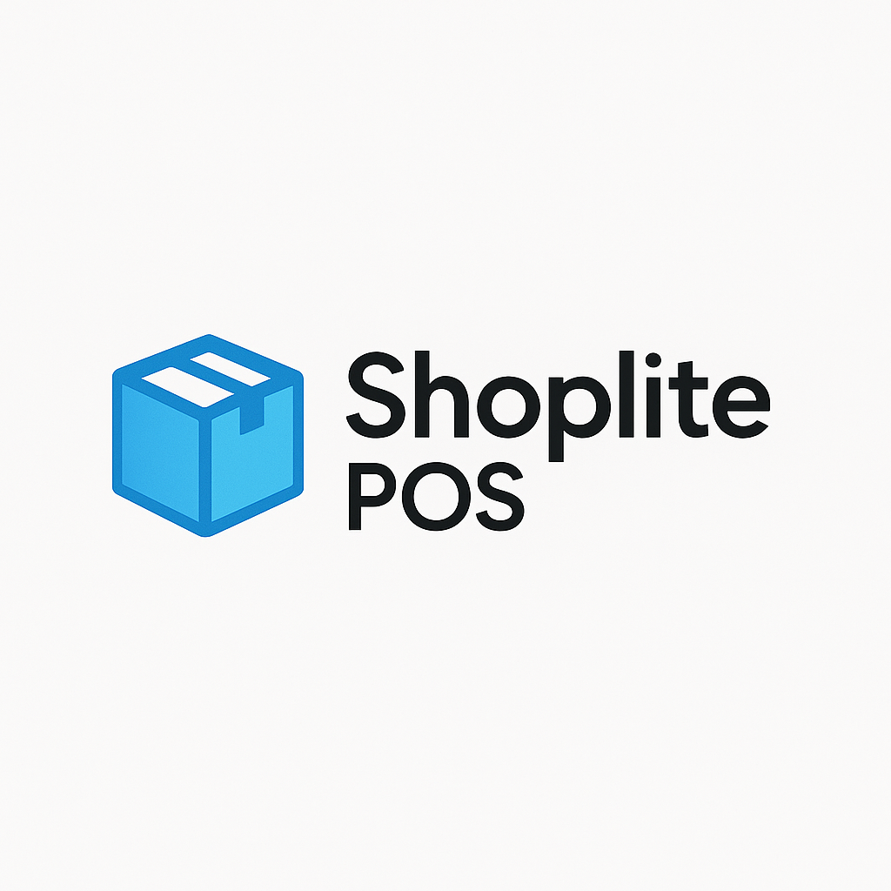

  

<h1 align="center">Shoplite POS</h1>

  Modern Inventory & POS System for Small Retail Shops  
  (Trial + Offline License Activation)

  
  
  

---

## 📦 Overview

**Shoplite POS** is a fast, lightweight and user-friendly inventory and point-of-sale system designed for small retail businesses.  
It helps shop owners manage stock, track sales, receive purchase orders, monitor profit, and maintain complete control over their store — all through a clean, modern interface.

Built with **Python (Flask)** and packaged for Windows, it works 100% offline and stores all data locally on the user’s machine.

---

## 🚀 Key Features

### 🔹 Inventory Management
- Barcode scanning support  
- Supplier code system  
- Low-stock alerts  
- Profit calculator (per product & total)  
- Instant search + category filtering  
- Real-time stock dashboard  

### 🔹 Sales / POS System
- Fast checkout  
- Barcode scanning adds items automatically  
- Multiple payment methods  
- Automatic change calculation  
- Clean, responsive layout  

### 🔹 Purchase Orders
- Create & track purchase orders  
- Receive stock directly from PO  
- Export all orders to CSV  
- Status management (pending / received)  

### 🔹 Product & Category Management
- Add/edit/delete products  
- Manage categories  
- Manage suppliers  
- Automatic cost/sale/profit calculations  

### 🔹 Analytics Dashboard
- Sales overview  
- YOY revenue chart  
- Category breakdown  
- Best-selling products  
- Total transactions  

### 🔹 Licensing System
- **5-day trial mode**  
- Offline license activation  
- Simple license format: `SHOPLITE-XXXX-YYYY`  

---

## 🖼️ Screenshots

> Place your screenshot images inside:  
> **`/screenshots/`**

### 🔐 License Screen

### 📊 Inventory Overview

### ➕ Add New Product

### ⚙️ Categories & Suppliers

### 🛒 Point of Sale

### 📈 Analytics Dashboard

### 📦 Purchase Orders

---

## 🛠 Installation

1. Download the installer (coming soon).  
2. Run **Shoplite_POS_Setup.exe**  
3. Choose:
   - **Start 5-Day Trial**, or  
   - **Activate License**

No internet required.

---

## 🔑 License System

- 5-day trial (full functionality)  
- Offline activation  
- License format:

Future plans include online activation and license sync.

---

## 📂 Project Structure

Shoplite_POS/
│
├── templates/ # HTML templates (Flask)
├── static/ # CSS, JS, icons
├── assets/ # Logos & UI images
├── images/ # Additional resources
├── screenshots/ # README images
│
├── Shoplite_POS.py # Main application
├── requirements.txt
├── LICENSE
└── README.md

---

## 🛣️ Roadmap

- Online license validation server  
- Multi-user support  
- Cloud backup  
- Printable receipts  
- MacOS version  
- Dark mode for full UI  

---

## 🤝 Support

For bug reports or feature requests, please open an issue in this repository.

---

## 📄 License

Released under the **MIT License**.

---

  © 2025 Shoplite POS

Data is stored locally at:

